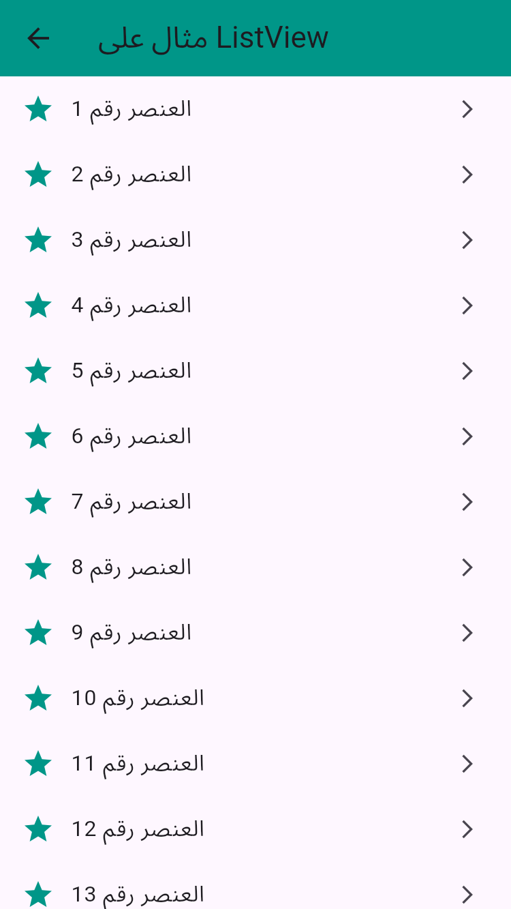

---

## 📁 Project Structure

```
lib/
├── main.dart                     # Entry point of the app
├── core/
│   └── theme/
│       └── app_theme.dart        # App theme (colors, text styles)
├── data/
│   └── dummy_data.dart           # Dummy product data
├── models/
│   └── product_model.dart        # Product model class
├── pages/
│   └── home_screen.dart          # Main screen displaying product list
├── widgets/
│   ├── category_list.dart        # Horizontal category filter
│   └── product_card.dart         # Widget to display individual products
```


---

## 🖼️ Screenshot

> 📌 Add your app UI screenshot here:


---

## 🧠 Features

- Display products by categories
- Uses dummy data to simulate backend
- Custom reusable widgets
- Clean and modular code structure

---