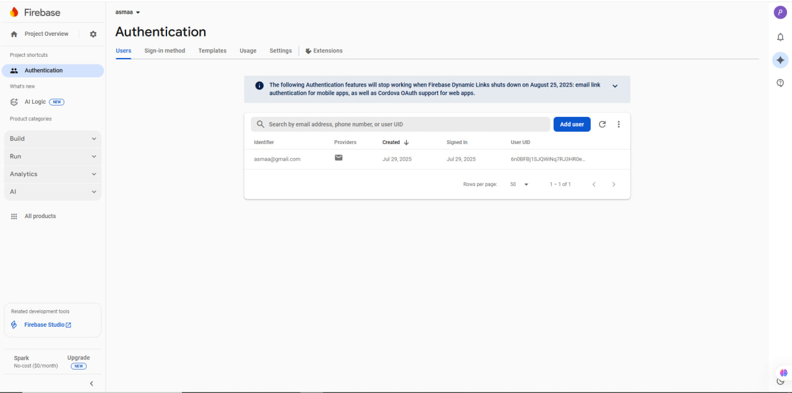
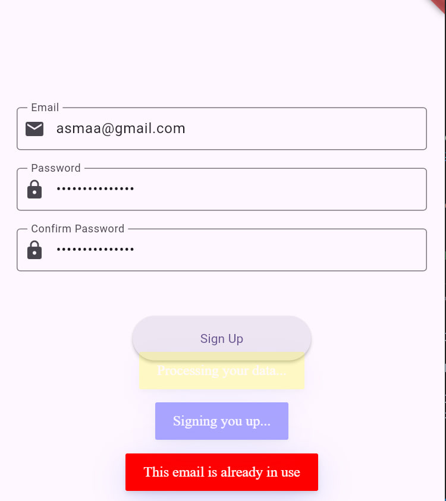

# 🔐 Sign Up Screen with Bloc & Firebase

This project demonstrates a **Sign Up Screen** in Flutter using the **Bloc Pattern** integrated with **Firebase Authentication**.  
It includes **form validation**, **state management**, and **real authentication** with Firebase, providing a production-ready structure for user registration.

---

## 📁 Project Structure

```bash
lib/
├── features/
│   └── signup/
│       ├── bloc/
│       │   ├── signup_bloc.dart
│       │   ├── signup_event.dart
│       │   └── signup_state.dart
│       ├── signup_screen.dart
│       └── signup_screen_with_bloc.dart
├── utils/
│   └── form_validator.dart
├── nav_feature/
│   ├── nav_examples.dart
│   └── nav_screen_two.dart
└── main.dart
```

---

## 🧠 Used Concepts

- **Flutter Bloc** for scalable state management.
- **Form validation** using `FormValidator` utility.
- **Firebase Authentication** for secure user registration.
- **FlutterToast** for real-time user feedback (success & error messages).
- **Navigation** using Flutter's built-in `Navigator`.

---

## ✅ Features

- **User Registration with Firebase**  
  Users are registered directly with Firebase Authentication.
- **Real-time Form Validation**  
  Email, password, and confirm password fields with error handling.
- **Bloc State Handling**
  - `SignUpInitial`
  - `SignUpLoading`
  - `SignUpSuccess`
  - `SignUpFailure`
- **Success & Error Toasts**
  Provide feedback based on Firebase responses.
- **Navigation**
  Automatically redirect the user to the next screen after successful sign-up.

---

## 🔧 Firebase Integration

The app is fully integrated with Firebase Authentication.

### Steps:
1. Add Firebase to your Flutter project using [FlutterFire CLI](https://firebase.flutter.dev/docs/cli/).
2. Install required dependencies:
   ```bash
   flutter pub add firebase_core firebase_auth flutter_bloc fluttertoast
   ```
3. Initialize Firebase in `main.dart`:
   ```dart
   void main() async {
     WidgetsFlutterBinding.ensureInitialized();
     await Firebase.initializeApp(
       options: DefaultFirebaseOptions.currentPlatform,
     );
     runApp(const MyApp());
   }
   ```
4. The `signup_bloc.dart` handles actual registration using:
   ```dart
   final userCredential = await FirebaseAuth.instance
       .createUserWithEmailAndPassword(email: event.email, password: event.password);
   ```

---


## 📌 Future Improvements

- Add login screen with Firebase Authentication.
- Integrate password reset functionality.
- Use Firebase Firestore for storing user profiles.
- Add error handling for network issues.

---

## 🏷️ Tech Stack

- Flutter 3.x
- Dart
- Bloc (State Management)
- Firebase Authentication
- FlutterToast

---

## 👨‍💻 Author

Developed with ❤️ using Flutter & Firebase.

## 📸 Screenshots

<p align="center">
  
  
</p>

