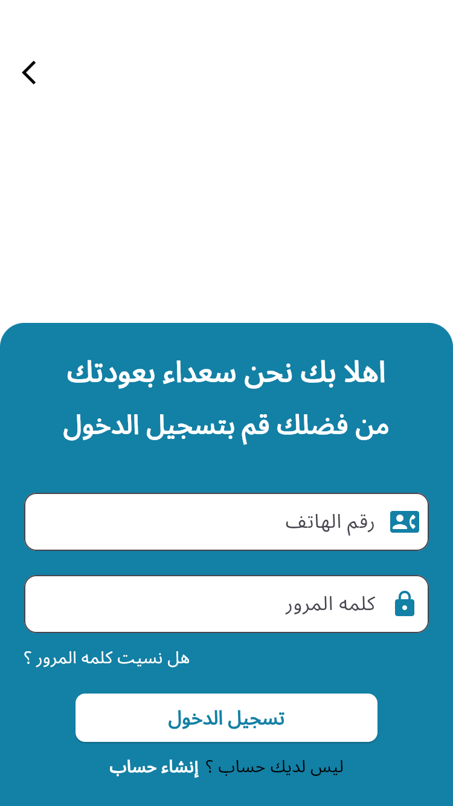
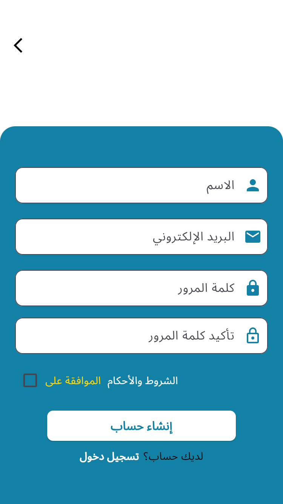

✨ About the Application

This Flutter app includes three main screens:

- A **Welcome Screen** featuring an image and a blue-colored section.
- A **Login Screen** with input fields for email and password.
- A **Sign-Up Screen** that contains password confirmation and a checkbox for agreeing to terms.

🧭 App Screens Overview

🔹 Welcome Screen
- Shows an image in the top white section.
- The bottom part has a blue container with navigation buttons.
- Uses a helper widget called `WelcomeScreenContent`.

🔹 Login Screen
- Includes fields for entering email and password.
- Has a "Forgot Password" link.
- Login button and a link to navigate to the Sign-Up screen.

🔹 Sign-Up Screen
- Fields included: name, email, password, confirm password.
- Contains a checkbox for accepting terms and conditions.
- Sign-Up button and a link to switch back to Login.

🎨 Design Details

- Colors are centralized in `app_colors.dart`.
- Text strings such as button labels are stored in `app_strings.dart`.
- Layout uses `MediaQuery` and `Expanded` for responsive design.

🖼️ App Screenshots

  
  

